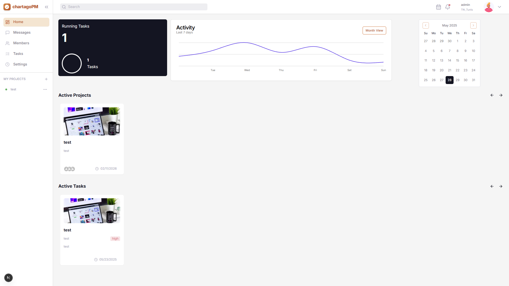
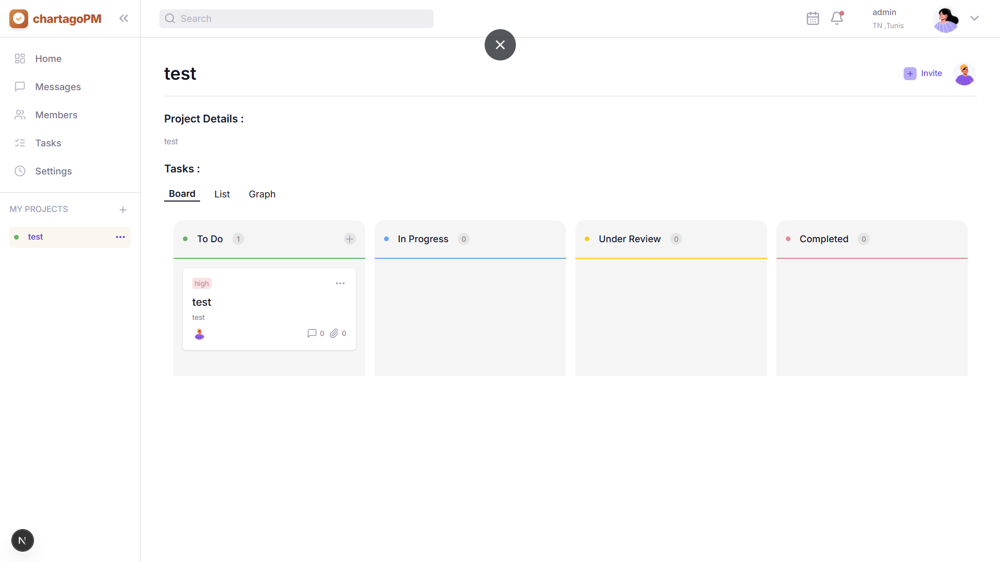

# Carthago Project Management

Welcome to **Carthago PM**! 🚀

A modern project management platform designed to help teams collaborate, track progress, and deliver results efficiently.

## 📁 Project Folder Structure

```
carthago-pm/
│
├── client/           # Frontend (Next.js + Tailwind CSS)
│   ├── app/          # Main app pages & routes
│   │   ├── dashboard/      # Dashboard views
│   │   ├── members/        # Team members management
│   │   ├── messages/       # Messaging features
│   │   ├── profile/        # User profile
│   │   ├── projects/       # Project views (Board, Graph, List)
│   │   ├── tasks/          # Task management
│   │   ├── timeline/       # Timeline & Gantt chart
│   │   └── types/          # TypeScript types
│   ├── components/   # Reusable UI components (Navbar, Sidebar, Modals, Cards, etc.)
│   ├── lib/          # Custom hooks & utilities
│   ├── public/       # Static assets (images, icons)
│   └── state/        # Redux slices & API logic
│
├── server/           # Backend (Node.js + Express + Prisma)
│   ├── prisma/       # Prisma schema & migrations
│   ├── src/          # API source code (controllers, routes, middleware)
│   └── ...           # Config & test files

```

## 🛠️ How It Works

- **Frontend**: Built with Next.js for fast, modern UI. All main features (dashboard, projects, tasks, members, etc.) are organized under the `app/` directory. UI components are modular and reusable.
- **Backend**: Node.js/Express API with Prisma ORM for database management. All business logic is in `src/controllers` and routes in `src/routes`.
- **State Management**: Uses Redux Toolkit for global state in the frontend.
- **Assets**: All images and static files are in `client/public/`.

## ✨ Project Highlights

- 📊 **Dashboard**: Visualize project progress and team activity.
- 🗂️ **Projects & Tasks**: Organize work with board, list, and graph views.
- 👥 **Team Collaboration**: Manage members, assign tasks, and communicate.

## 🖼️ Screenshots

| Dashboard Example                        | Project Board                                |
| ---------------------------------------- | -------------------------------------------- |
|  |  |

---

Made with ❤️ for productive teams!
